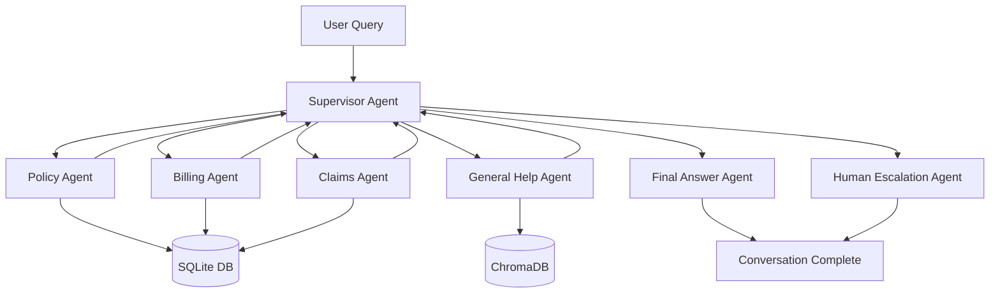

# Building an Intelligent Multi-Agent Insurance Support System with Groq & LangGraph

🛡️ **An end-to-end insurance support copilot that combines LangGraph, Retrieval-Augmented Generation (RAG), and structured data to resolve customer requests.**

## 🌟 Key Features

- **Groq-Powered Speed**: Migrated to [Groq](https://groq.com/) using Llama 3 models for near-instant inference.
- **Native OpenAI SDK Integration**: Implemented using the native OpenAI Python SDK (compatible mode) for clean, standardized code.
- **Multi-Agent Orchestration**: Specialized agents for Policy, Billing, Claims, and General Help managed by a Central Supervisor.
- **Streamlit Frontend**: A modern, interactive chat interface for real-time customer interaction.
- **Relational & Vector Data**: Unified access to SQLite (Policy/Billing) and ChromaDB (FAQ Knowledge Base).
- **Escalation Logic**: Automatic handoff to human agents for complex cases or infinite loops.

## 🛠️ Tech Stack

- **LangGraph**: Workflow orchestration and state management.
- **Groq (Llama 3.1 8B/70B)**: High-performance LLM backend.
- **OpenAI SDK**: Native client configured for Groq-compatible endpoints.
- **Streamlit**: Web frontend for user interaction.
- **SQLite**: Relational database for policy, billing, and claims info.
- **ChromaDB**: Vector database for semantic FAQ retrieval.
- **Sentence Transformers**: Local embeddings for RAG.

## 📐 Architecture



Each specialist node returns to the supervisor, which decides whether to continue the loop, request clarification, or pass control to the **Final Answer Agent** for a customer-ready response.

## 🚀 Getting Started

### 1. Installation

```bash
# Clone the repository
git clone https://github.com/Muskan-gupta04/MultiAgent-Insurance-AI
cd multi-agent-system-main

# Install dependencies
pip install -r requirements.txt
```

### 2. Configuration

Create a `.env` file in the root directory:
```env
GROQ_API_KEY=your_groq_api_key_here
INSURANCE_DB_PATH=insurance_support.db
CHROMA_PATH=./chroma_db
```

### 3. Launching the App

Start the interactive Streamlit dashboard:
```bash
streamlit run app.py
```

## 🧪 Validated Test Data

Use these values in the chat to test the system's retrieval capabilities:

| Test Case | ID / Policy | Description |
|-----------|-------------|-------------|
| **Auto Policy** | `POL000004` | Test vehicle details & coverage limits. |
| **Home Policy** | `POL000001` | Test premium lookup & billing cycles. |
| **Claims** | `CLM000001` | Check status of an existing claim. |
| **FAQ** | "How do I file?" | Triggers RAG search in ChromaDB. |

## 🎓 Project Highlights

1. **Clean Prompts**: All agent instructions are modularized in `mas/prompts.py` as pure text strings.
2. **Robust LLM Parsing**: Custom `run_llm` logic in `mas/llm.py` handles complex tool-calling loops natively via the OpenAI SDK.
3. **Data Quality**: Integrated `sample_data.py` generator ensures a realistic testing environment with 1,000+ customers.
4. **State Persistence**: The `GraphState` preserves conversation history, extracted entities, and routing justifications throughout the session.

---

